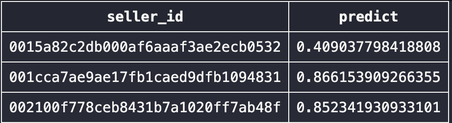

# Data Science como ferramenta para retenção de clientes da Olist

### **Introdução**

Neste projeto foi aplicado um conjunto de conceitos adquiridos em Data Science focando localizar os clientes da Olist com dificuldades em realizar vendas para que estratégias de retenção possam ser aplicadas. Do banco de dados da Olist, foram extraídas as variáveis de importância (ETL) e a partir destes dados foram elaborados experimentos com diversos algoritmos de Machine Learning a fim de selecionar aquele que obteve melhor desempenho na detecção destes vendedores. 
Esta é uma demonstração de como o Data Science pode ser introduzido em um ambiente corporativo, neste exemplo foi abordado a redução da taxa de churn.
Neste texto estou explicando de maneira superficial o que foi realizado, os detalhes e as explicações de cada processo estão no meu repositório do [GitHub](https://github.com/thifujikawa/clientes_olist)

### **O que é a Olist**

A Olist é uma plataforma de e-commerce que utiliza sua expertise intermediando o vendedor com grandes marketplaces de maneira que um único produto cadastrado seja distribuído para diversos marketplaces simultaneamente facilitando e aumentando as chances de vendas.

### **Etapas do Projeto:**
Para este projeto foi realizado a divisão em diversas etapas:

1. [**Problema de Negócio**](#problema_negocio) Um Problema real de negócio que empresas como a Olist constamente enfretam 
2. [**ETL**](#etl) Extração dos dados do banco, geração de variáveis para análise
3. [**Pré Processamento e Construção do Modelo**](#preproc) Análise exploratória dos dados, Processamento dos dados e Construção do modelo de machine learning
4. [**Operacionalização**](#operacional) Utilização do algoritmo treinado para geração de scores dos vendedores
5. [**Estratégia de Negócio**](#negocio) Como pode ser aplicada os resultados a fim de resolver o problema de negócio

### **1 - Problema de negócio** 

A Olist oferta planos mensais para seus clientes, somado a mensalidade é cobrado um valor de comissão por produto vendido.
Como o Custo de Aquisição do Cliente (CAC) costuma ser mais alto do que manter o cliente com estratégias de retenção, é de extrema importância para a Olist o sucesso dos seus clientes. 
Utilizando um algoritmo podemos localizar os clientes que tendem a não realizar vendas em um futuro próximo desta maneira pode-se realizar certas campanhas, ações ou consultorias direcionadas aos usuários com o intuito de melhorar suas vendas.

### **2 - ETL (*Extraction Transform Load*)** 

 

A base de dados fornecida pela Olist é composta de diversas tabelas com diferentes informações. Através delas foram geradas as possíveis variáveis preditoras relevantes ao problema abordado. O Book de Variáveis contempla todos estes dados em uma única tabela.
Explicando de maneira superficial, para que o algoritmo de Machine Learning possa interpretar e trazer predições é necessário criar uma variável resposta e a partir desta resposta o algoritmo detecta a mudança de padrões e o quanto elas impactaram em sua variável resposta.
Para este conjunto de dados foi aplicado o conceito de safras que agrupa toda as vendas efetivadas durante 6 meses. Para elaboração da variável resposta foi considerado os próximos 3 meses.

### **3 – Processamento, Exploração dos dados e Construção do modelo** 

De posse dos dados do vendedor e sua performance em cada safra, foi analisada a presença de dados nulos, geração de gráficos uni-variados e multivariados para análise, assim é possível ver a disposição dos valores e a correlação entre as variáveis.
A análise exploratória de dados foi de fundamental importância pois:  
* Permitiu identificar possíveis clientes fraudadores que a princípio não eram interessantes para este caso e como não se tratam de dados relevantes ao problema abordado os mesmos foram devidamente retirados;
* Através da visualização de correlação entre variáveis foram excluidas 2 variáveis que não estavam agregando valor ao dataset;
* Definir qual métrica aplicar para substituição de dados nulos presentes no dataset.  

Definidas as estratégias para lidar com este dataset foi possível verificar como alguns dos algoritmos estão performando. Com base nos resultados obtidos foram utilizadas métricas de validação e tempo de processamento para a escolha de apenas um algoritmo que posteriormente recebeu otimização que consiste em alterar parâmetros no algoritmo a fim de melhorar os resultados analisados. 

### **4 – Operacionalização** 

Utilizando o algoritmo treinado na fase anterior o mesmo irá fazer uma predição das chances do vendedor realizar alguma venda nos próximos 3 meses, esta resposta pode variar entre 0 e 1. Quanto maior este score, maiores são as chances de ocorrer vendas. 
O Id do vendedor junto ao score atribuído pelo algoritmo é enviado para uma tabela no banco de dados  

### **5 – Possíveis estratégias de negócio** 

Com este score podemos estudar como atuar para impulsionar as vendas utilizando diferentes campanhas para os vendedores. Com estes resultados foi possível separar os vendedores em 4 grupos de acordo com o score:

| Intervalo entre os scores &nbsp; &nbsp;| Ações |
|:----------: | :------------- | 
| **1 e 0,81** | Possuem uma grande chance de não realizarem vendas e podem ser ofertadas soluções que requeiram um investimento maior como: uma consultoria personalizada, desconto na comissão das vendas, meses grátis na plataforma.|
|**0,8 e 0,61** | Para este grupo de vendedores podem ser aplicados outras campanhas de retenção que não exijam tanto investimento quanto ao grupo anterior: envio de e-mails com melhores práticas para vendas, aumentar a relevância e o alcance, aumentar a variedades de produtos na plataforma afim de melhorar as vendas.|
|**0,6 e 0,35**  | Estes vendedores ainda podem representar um potencial risco de não realizar vendas portanto campanhas de e-mails contendo as tendências de vendas atuais e outras análises podem aumentar ainda mais as chances de vendas.|
|**0,34 e 0** | Representam clientes que potencialmente vão realizar vendas e que não serão foco para este case.|

