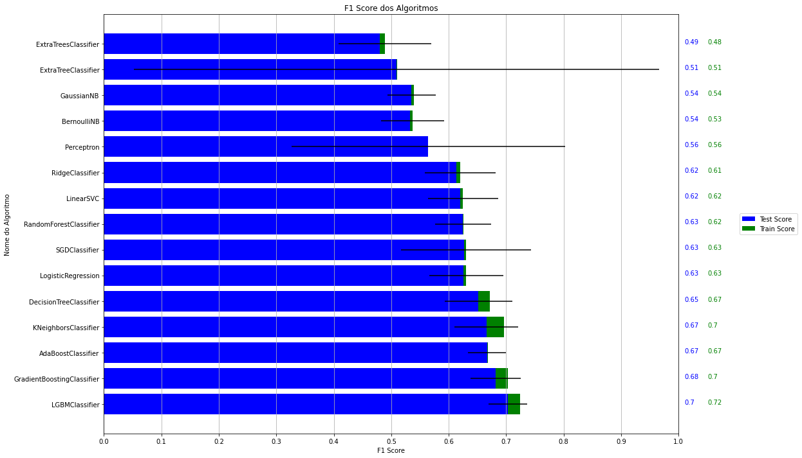
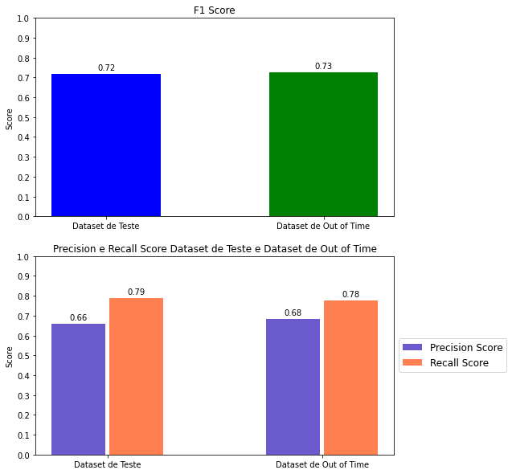
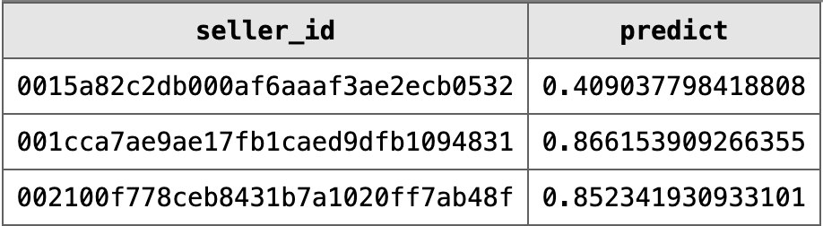

# Data Science como ferramenta para retenção de clientes da Olist

## **Introdução**

Este projeto tem como objetivo selecionar entre todos os clientes que utilizam o serviço da Olist, identificar aqueles que apresentam dificuldades na realização de suas vendas e propor estratégias específicas de acordo com o perfil de cliente afim de evitar a saída futura dos clientes da Olist.
Para alcançar esse objetivo, foram selecionados variáveis de importância extraídas do banco de dados da Olist e utilizados em diversos algoritmos de machine learning resultando no modelo com o melhor desempenho para a identificação destes clientes.

Neste relatório, apresento uma visão geral da metodologia empregada e dos resultados obtidos, a fim de demonstrar como conhecimentos de Data Science podem ser aplicados em um problema de negócio. Os detalhes técnicos e explicações minuciosas de cada processo encontram-se no meu repositório do [GitHub](https://github.com/thifujikawa/clientes_olist)

## **O que é a Olist** 

A Olist é uma plataforma de e-commerce que utiliza sua expertise intermediando o vendedor com grandes sites de comércio eletrônico, de maneira que um único produto cadastrado seja distribuído para os principais sites simultaneamente facilitando o vendedor e aumentando as chances de vendas.

## **Metodologia:**
Para este projeto foi realizado a divisão em diversas etapas:

1. [**Problema de Negócio**](#problema_negocio) Um Problema real de negócio que empresas como a Olist constamente enfrentam.
2. [**Entendimento dos dados**](#data_understanding) Compreender como o banco de dados esta estruturado.
3. [**Extração Transformação e Carga (ETL-*Extraction Transform Load*)**](#etl) Extração dos dados do banco, geração de variáveis para análise
4. [**Análise Exploratória de Dados (EDA-*Exploratory Data Analysis*) e Construção do modelo**](#preproc) Análise exploratória dos dados, Processamento dos dados e Construção do modelo de machine learning
5. [**Resultados**](#resultados)
6. [**Implementação do modelo**](#implementação) Utilização do algoritmo treinado para geração de scores dos vendedores
7. [**Estratégia de Negócio**](#negocio) Como pode ser aplicada os resultados a fim de resolver o problema de negócio

### **1 - Problema de negócio** 
A Olist é uma startup que possui seu modelo de negócio baseado em assinaturas mensais e comissão por vendas, portanto, é de extrema importância para a Olist que seus vendedores consigam concretizar vendas para permanecerem no negócio. Outro fator a ser considerado é que neste tipo de negócio, manter um assinante na plataforma com estratégias de retenção costumam ser menos custosos camparadas as campanhas de marketing para aquisição de novos clientes.

#### **1.1 - Solução para o problema**
Afim de minimizar o número de clientes que irão deixar a Olist, será utilizado o banco de dados para criar um modelo preditivo e assim determinar quais serão as chances deste cliente deixar de realizar vendas utilizando a plataforma, desta maneira, pode-se realizar determinadas campanhas, ações ou consultorias direcionadas aos usuários com o intuito de evitar que os usuários abandonem a empresa.

[**Voltar**](#voltar)

### **2 Data Understanding (*Entendimento dos dados*)**   

<figure>

 

<figcaption> Figura1: Esquema do banco de dados da Olist </figcaption> 
</figure>

Com o problema identificado e o que se espera da resposta do algoritmo, o próximo passo é compreender o banco de dados. Para esta etapa, é fundamental que a empresa possua uma boa estrutura no banco de dados, pois um bom modelo de machine learning depende dos dados deste banco para o treinamento do algoritmo.

A base de dados da Olist foi elaborada em star scheme (Esquema Estrela), modelo amplamente adotado em data warehouses.Pode-se observar na figura 1, onde no centro temos a tabela *orders_dataset* rodeadas de tabelas auxiliares. As tabelas auxiliaries contém informações relacionadas a forma de pagamento, itens comprados, avaliação da compra por parte de comprador, dados dos compradores entre outros

A tabela *olist_orders_dataset* possui todos os pedidos realizados durante o periodo de 15/09/2016 à 3/09/2018 totalizando 99441 registros.

No início havia idealizado uma solução do problema focado nos usuários que sairam da plataforma, porém infelizmente como as tabelas focam apenas em dados referente a ordens de compra e não aos usuários que entraram e sairam da plataforma, tive que alterar abordagem do problema, por isto e outros motivos esta etapa é uma das etapas fundamentais.

[**Voltar**](#voltar)

### **3 - Extração Transformação e Carga (ETL-*Extraction Transform Load*)**  

Nesta fase reúne-se dados de diferentes tabelas em apenas uma tabela, a seleção.
Para selecionar quais destes dados irão para tabela é preciso um conhecimento prévio do negócio, pois é através do uso destes indicadores que o algoritmo compreenderá o comportamento dos clientes que tendem a não realizar vendas.
Além das variáveis geradas citadas acima para que o algoritmo possa compreender as alterações é necessário que ele saiba quais clientes realizaram ou não vendas nos próximos 3 meses, isto é chamado de variável resposta, portanto, nesta tabela teremos as variaveis geradas junto a variável resposta.
Abaixo segue algumas estratégias utilizadas para a confecção da tabela.

### Geração das Safras   
Como a base de dados possui apenas dados relacionados a vendas realizadas durante 2 anos, criei partições destes dados, que nada mais são que um agrupamento dos dados dos vendedores de um determinado periodo, neste caso, foi considerado um periodo de 6 meses de atividade deste vendedor e nos 3 meses seguintes se houve alguma venda.   
Exemplo:  
Os dados de vendas do usuário durante os meses de Janeiro e Junho foram coletados processados e enviados para a tabela.Já a variável resposta irá considerar se houve vendas nos próximos 3 meses após o mes de Julho, desta maneira o algoritmo pode avaliar de acordo comportamento do usuário no periodo observado e se houve ou não vendas.   
As safras selecionadas contemplam os seguintes dados:

|Safra       | Comportamento do usuário nos meses   | Periodo observado se houve vendas     |
|----------- |----------------                      | ----------------                      |
|Abr/17      | Out/16 à Abr/17                      | Mai/17 à Jul/17                       |
|Mai/17      | Nov/16 à Mai/17                      | Jun/17 à Set/17                       |
|Jun/17      | Dez/16 à Jun/17                      | Jul/17 à Out/17                       |
| &mdash;    | &mdash;                              | &mdash;                               |
|Mai/18      | Nov/17 à Mai/19                      | Jun/18 à Set/18                       |

### Criação das Variáveis   
Definida a estratégia de particionar os dados gerando safras o próximo passo é reunir todas as informações pertinentes a este problema em uma única tabela.
Nesta tabela, as linhas temos dados do usuário e as colunas informações pertinentes a este usuário. Esta e a etapa anterior sobre o entendimento dos dados são de grande importância para o sucesso do projeto, pois é através do refinamento correto de dados das informações referente ao usuário que permitirão auxiliar e obter sucesso do treinamento do modelo.
Abaixo demonstro as variáveis geradas e utilizadas neste projeto.

|Variável                       |Descrição                                                              |
|-----------                    |----------------                                                       |
|Safra                          |Indica a Safra do dado                                                 |
|Seller ID                      |Identificação do Usuário                                               |
|flag venda                     |Indica se houve vendas nos 3 meses seguintes (Variável Resposta)       |
|estado                         |Estado do Usuário                                                      |
|idade_dias                     |Qtde de dias que entrou na Plataforma                                  |
|qtde_vendas                    |Qtde de Vendas                                                         |
|variedade_prod                 |Variedade de Produtos Vendidos                                         |
|qtde_prod_vendidos             |Quantidade de Produto Vendidos                                         |
|media_prod_vendidos_order      |Média da Quantidade de Produtos Vendidos por ordem                     |
|media_fotos                    |Média de Fotos nos Anúncios                                            |
|media_letras_desc              |Média de Letras Utilizadas nas Descrições                              |
|avaliacao_safra                |Avaliação das vendas na Safra                                          |
|avaliacao_acumulada            |Avaliação das vendas desde que entrou na Olist                         |
|delta_avaliacao_idade_base     |Diferença entre avaliação Acumulada e da Safra                         |
|ultima_venda                   |Qtde em dias da última venda                                           |
|qtde_mes_ativos                |Qtde de meses que realizou vendas na safra                             |
|prop_atrasos                   |Proporção de atrasos no recebimento que ocorreram nas vendas           |
|media_prazo_entrega            |Média em dias do prazo de entrega                                      |
|ticket_medio                   |Média do valor gasto por venda                                         |
|valor_medio_prod               |Média do valor dos produtos vendidos                                   |
|total_mensal                   |Total Mensal de vendas                                                 |
|frete_medio                    |Valor médio do Frete                                                   |
|prop_valor_frete               |Proporção entre o valor do frete e do Produto                          |
|intervalo_pedidos_dias         |Quantidade de vendas realizadas durante uma safra (6 meses)            |

### Execução da Etapa
A Etapa de Extração, Transformação e Carregamento dos dados (***ETL***) foi elaborada da seguinte maneira:   
Seleção das Variáveis : Um arquivo em formato SQL, efetua a seleção e criação das variáveis acessando as diferentes tabelas e cruzando dados quando necessário.
Criação da tabela com safras: Um arquivo utilizando linguagem Python realiza a criação da tabela. Ao usuário inserir a data de início da safra e a quantidade desejada de safras, preenche a tabela utilizando o arquivo de seleção de variáveis. Deste maneira em um tabela temos as safras e todas as variáveis que foram escolhidas;

[**Voltar**](#voltar)

### **4 – Análise Exploratória de Dados (EDA - Exploratory Data Analysis) e Construção do modelo** 

Após a geração da tabela e o preenchimento com dados dos vendedores, chega a fase de análise dos dados, esta análise se iniciou avaliando o tamanho da tabela (Linhas X Colunas), em seguida quais tipos de variáveis a tabela possui (Nominais, Ordinais, Discretas e Continuas), nesta etapa ocorreram algumas correções já que dados numéricos haviam sido interpretados como caracteres.
Após a correção dos dados se iniciou a Análise Exploratória dos dados é de suma importância e tem como objetivo de identificar previamente os dados discrepantes, a normalidade da distribuição de frequências e a variação dos dados. Muitas vezes os valores discrepantes demonstram problemas, erro de digitação, fraudes, diferente moeda monetária.
Através da Análise Exploratória permitiu notar que:
* Presença de valores ausentes na tabela e necessitou estratégias de substituição que serão realizadas na fase de modelagem para evitar viés.
* Ao verificar a distribuição dos dados de maneira gráfica alguns vendedores demonstraram um comportamento estranho(Vendedores com poucas vendas com Valor da venda muito alto e baixa avalição) ao investigar um pouco mais estes usuários no banco de dados pode-se notar que são possíveis fraudadores, já que estes usuários não haviam recebido seus produtos ou receberam modelo não condizentes ao anúncio. Como estes usuários não são interessantes para este projeto os mesmos foram removidos da tabela.
* Através da visualização de correlação entre variáveis foram excluidas 2 variáveis pois estavam altamente corelacionadas as outras, desta maneira evitamos que o algoritmo de considere variáveis que estariam explicando a mesma coisa.
Após a análise exploratória, a última safra foi separada e

Ao término da Análise Exploratória pode-se compreender e tratar os dados. Tendo os dados "tratados" a etapa de modelagem do algoritmo se iniciou.

### Modelagem
Para iniciar e avaliar o modelo foi retirada a última safra do *dataset*(tabela que foi processada anteriormente), esta será utilizada próximo do fim do projeto com o objetivo de avaliar como o algoritmo irá se comportar com dados novos.
Para verificar se um algoritmo performa bem não se pode utilizar os dados que foram utilizados para treino. Pois são dados que já foram vistos pelo algoritmo (é como se você já tivesse visto o gabarito de um teste). Nesta etapa foi utilizada a Validação Cruzada e KFolds que separa o dataset em K partes onde 1 desta parte é selecionada para teste e as restantes para treino, tendo um modelo treinado com estas partes ele utiliza os dados de teste e baseado na resposta que o modelo previu temos um resultado, este é confrontado com o valor que já se sabe e temos a quantidade de acertos e erros. A Validação Cruzada com KFolds é um processo iterativo onde se temos 10 folds esta validação será feita 10 vezes, cada uma utilizando 1 fold diferente para teste.
Como existem diversos algoritmos de machine learning cada um com suas qualidades e defeitos, foi selecionados alguns afim de criar modelos de previsão, através desta previsão pode-se ter um panorama de como os algoritmos errou/acertou.

<figure>

 

<figcaption> Figura2: Resultados obtidos na fase de seleção do algoritmo </figcaption> 
</figure>

A métrica utilizada para avaliar os resultado foi a F1 Score. Na Figura 2 pode-se observar que o modelo LGBMClassifier(Light Gradient Boosting Machine) forneceu os melhores resultados. Baseado nestes resultados e tendo escolhido o modelo a ser utilizado e iniciou-se a etapa de otimização do algoritmo.
Para maximizar a quantidade de acertos o modelo possui parametros que podem ser alterados, esta etapa possui um alto custo computacional pois dado alguns parametros ele irá realizar todas as combinações possíveis, algumas estratégias foram adotadas nesta etapa afim de diminuir o número de combinações e achar um resultado mais rápido.
No início desta etapa foi citado a respeito da ultima safra retirada do dataset, nesta etapa ela foi utilizada, desta maneira esses dados são novos para o modelo já que ele foi retirado da fase inicial do processo.

[**Voltar**](#voltar)

### **5 – Resultados** 

Através do dataset de Out of Time que foi retirado no início do processo pode-se ter verificar como o modelo esta prevendo novos dados que não foram utilizados na fase de modelagem do sistema.

<figure>

 

<figcaption> Figura3: Resultados da fase de otimização F1 Score e Precision Recall </figcaption> 
</figure>

A Figura 3 demonstra os resultados do modelo em 2 dataset o Dataset de Teste foi utilizado na fase de otimização e o Dataset Out of Time não havia sido utilizado em nenhum momento durante a fase de treinamento do algoritmo, portanto, são dados totalmente novos para o modelo.
Ao avaliar os resultados obtidos através do modelo utilizando o dataset Out of Time temos:
* 68% de precisão, isto é, o modelo acertou em 68% dos usuários que não fizeram vendas nos próximos 3 meses;
* 78% de revocação/recall, de todos os usuários que não venderam o modelo pode capturar 78% das pessoas deste grupo.

[**Voltar**](#voltar)

### **6 – Implementação do modelo** 

Para implementar este modelo, foi criado um arquivo em formato Pickle contendo o modelo e parametros necessários para o modelo funcionar corretamente.
Geralmente problemas desse tipo o modelo responde apenas de 0 ou 1 (Irá ou nao realizar vendas), mas existe a possibilidade do modelo enviar a resposta em probabilidade. Através da probabilidade podemos classificar em grupos estes usuários de acordo com a chance de efetuar vendas.

<figure>

 

<figcaption> Figura4: Scores dos usuários </figcaption> 
</figure>

Na Figura 4 temos o modelo prevendo as chances de cada usuário não realizar as vendas, estes resultados estarei chamando de scores dos vendedores.
Com o ID do Vendedor junto ao seu respectivo score é enviada para uma nova tabela no banco de dados. Esta Tabela pode ser fornecida para o departamento responsável pelas ações de retenção dos usuários. 

[**Voltar**](#voltar)

### **7 – Possíveis estratégias de negócio** 
 
Com a tabela com usuários e respectivos score podemos estudar como atuar para impulsionar as vendas utilizando diferentes campanhas para os vendedores. Com estes resultados foi possível separar os vendedores em 4 grupos de acordo com o score:

| Intervalo entre os scores &nbsp; &nbsp;| Ações |
|:----------: | :------------- | 
| **1 e 0,81** | Possuem uma grande chance de não realizarem vendas e podem ser ofertadas soluções que requeiram um investimento maior como: uma consultoria personalizada, desconto na comissão das vendas, meses grátis na plataforma.|
|**0,8 e 0,61** | Para este grupo de vendedores podem ser aplicados outras campanhas de retenção que não exijam tanto investimento quanto ao grupo anterior: envio de e-mails com melhores práticas para vendas, aumentar a relevância e o alcance, aumentar a variedades de produtos na plataforma afim de melhorar as vendas.|
|**0,6 e 0,3**  | Estes vendedores ainda podem representar um potencial risco de não realizar vendas portanto campanhas de e-mails contendo as tendências de vendas atuais e outras análises podem aumentar ainda mais as chances de vendas.|
|**0,3 e 0** | Representam clientes que potencialmente vão realizar vendas e que não serão foco para este case.|

## Considerações finais
Este projeto pode abranger desde início de um projeto da Data Science partindo de um problema de negócio, utilização do banco de dados da empresa, extração e análise dos dados, seleção e otimização do algoritmo de machine learning e por fim um programa que utiliza o algoritmo de machine learning para realizar o score dos vendedores. A partir destes scores pode-se realizar agrupamentos para campanhas distintas de retenção.   
Sou formado em engenharia e em todos projetos que participei busquei acompanhar todo os passos do projeto, através desta participação pude adquirir conhecimentos de áreas totalmente adversas a que trabalhava e que de forma direta ou indireta contribuiram em diversos projetos e me agregou diversos conhecimentos.

[**Voltar**](#voltar)

## 🙍 Autor 
Feito por Thiago Ide.

